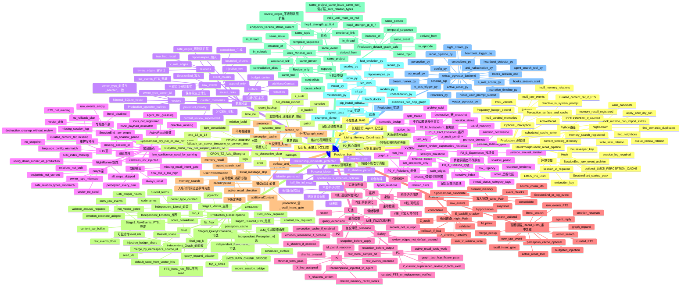

# LMC-5 专业思维导图 AI版

```mermaid
mindmap
  root((LMC-5))
    定位
      Living_Memory_Coordinate_5
      长期运行_Agent_记忆层
      Provider_free
      不是普通_RAG
      目标_可恢复连续性
      反目标_无限上下文幻觉

    P0_核心原则
      记忆必须有来源
      事实必须可演化
      关系必须可召回
      情绪不能改写真相
      维护必须可回滚
      召回闭环最高优先级

    数据分层
      raw_events
        append_only
        保存发生过什么
        不直接当长期事实
        SessionEnd_写入
        raw_events_FTS_兜底
      event_chunks
        consolidate_生成
        bounded_chunks
        source_links
        hippocampus_输入
      curated_memories
        长期记忆主表
        XYZEM_坐标
        current_review_superseded
        protected_identity
      vectors
        owner_type_owner_id
        Minimal_SQLite_vector
        Production_pgvector_halfvec
        owner_type_必须与_adapter_一致
      relations
        Y_axis_edges
        safe_edges_可默认扩展
        review_edges_需审计
        two_hop_recall
      surface
        additionalContext
        redaction
        budget_control
        injection_text

    XYZEM_五轴
      P0_X_Timeline_必做
        thread_status_category_tags
        记忆归属历史线
        chunks_保留时间范围
        timeline_sweep
        narrative_index
        other_是孵化区
      P0_Y_Relations_必做
        typed_relations
        safe_edges
        relation_hints
        graph_expand
        two_hop
        strength_threshold
        live_endpoints_only
      P1_Z_Fact_Evolution_推荐
        fact_key
        active_fact
        version_status
        current_review_superseded_historical
        z_audit_pending
        persona_manual_gate
        不自动覆盖身份事实
      P2_E_Experience_按场景
        risk_urgency
        valence_arousal_tension
        response_tendency
        emotion_confidence
        shadow_period
        情绪调姿态不改事实
      P2_M_Metabolism_按规模
        patrol_readonly
        promote_demote
        archive_cold
        split_thread
        semantic_dedup
        destructive_需_snapshot

    实施优先级
      必做
        X线_可归属
        Y线_可写入并召回
        相关记忆浮现
        召回闭环
      推荐
        Z线_事实演化
        主动检索
        情绪联想
      可选
        E线_高级体验评分
        M线_自动衰减归档
        自发浮现_presence
        query_expansion
        rerank

    三条闭环
      写入链路_Write_Path
        SessionEnd_or_log_event
        raw_events
        consolidate
        event_chunks
        hippocampus_candidate
        curated_memory
        source_chunk_ids
      夜间链路_Night_Path
        snapshot
        consolidate
        hippocampus
        safe_Y_relation_write
        Z_audit
        E_backfill_shadow
        X_timeline_narrative
        M_patrol
        validation
        rollback_if_bad
      召回链路_Recall_Path_重中之重
        recall_intent_gate
        vector_search
        curated_FTS
        raw_events_FTS
        literal_search
        active_recall_tool
        graph_expand
        emotion_resonate
        perception_cache_optional
        merge_dedup
        rerank_optional
        budgeted_injection
        agent_reply
        new_raw_event

    召回入口
      被动召回_必做
        UserPromptSubmit
        RecallPipeline
        additionalContext
        trivial_message_skip
        production_需_recall_intent_gate
      主动检索_推荐必做
        active_recall_directive
        agent_search_tool
        memory_search
        memory_recall
        不确定先查
        人名时间词过去事件先查
      自发浮现_可选
        perception_py
        perception_cache
        surface_and_cache
        presence
        不作为graph_seed
        不每轮硬塞

    Production_RecallPipeline
      Stage0_QueryExpansion_可选
        query_expand_adapter
        LLM_生成搜索角度
      Stage1_Vector_主路
        pgvector
        embedder
        owner_type_curated
        top_k
      Stage2_Curated_FTS_兜底
        content_tsv_required
        GIN_index_required
        fts_floor
      Stage3_RawEvents_FTS_兜底
        lmc5_raw_events
        content_tsv_builtin
        raw_events_floor
      Independent_Literal_必留
        CJK_proper_nouns
        quoted_terms
        codenames
        not_vector_gated
      Independent_RawChunk_可选
        LMC5_RAW_CHUNK_BRIDGE
        recent_session_bridge
        top_k_small
      Independent_Graph_必验收
        seed_ids
        default_seed_from_vector_hits
        FTS_literal_hits_默认不当seed
        可显式传seed_ids
      Independent_Emotion_推荐
        emotion_resonate_adapter
        Russell_space
        valence_arousal_required
      Independent_Perception_可选
        perception_cache
        scheduled_surface
      Final
        merge_by_namespace_source_id
        score_breakdown
        final_top_k
        injection_budget_chars

    Y关系类型
      Core_Minimal_safe
        same_issue
        same_project
        same_tool
        same_event
        same_topic
        temporal_sequence
        emotional_link
        in_thread
        same_person
        in_episode
        instance_of
        derived_from
      Production_default_graph_safe
        same_event
        same_topic
        temporal_sequence
        emotional_link
        derived_from
        in_thread
        same_person
        in_episode
        instance_of
      Review_only
        contradicts
        contradiction_alias
        supports
        cause_effect
      断点
        same_project_same_issue_same_tool_需扩展_safe_relation_types
        review_edges_不进默认图扩展
        valid_until_must_be_null
        endpoints_version_status_current
        hop1_strength_gt_0_4
        hop2_strength_gt_0_7

    Minimal_实现
      src_lmc5
        cli_py
        store_py
        models_py
        consolidation_py
        hippocampus_py
        fact_evolution_py
        metabolism_py
        scoring_py
        vector_py
        redact_py
      验收
        pip_install_editable
        lmc5_doctor
        pytest_tests
        examples_demo
        examples_two_hop_graph

    Production_实现
      extras_pgvector_backend
        schema_sql
        config_py
        vector_pgvector_py
        embedders_py
        rerankers_py
        recall_pipeline_py
        hooks_session_start
        hooks_user_prompt_submit
        hooks_session_end
        night_dream_py
        dream_runner_py
        narrative_timeline_py
        ob_recall_py
        e_axis_scorer_py
        e_axis_trigger_py
        perception_py
        heartbeat_detector_py
        heartbeat_trigger_py
        active_recall_py
        agent_search_tool_py
        anti_hallucination_py

    Production_必接线
      环境变量
        LMC5_PG_DSN
        embedder_key
        housekeeper_key
        optional_LMC5_PERCEPTION_CACHE
      Python路径
        hook_runtime_can_import_extras
        correct_working_directory
        PYTHONPATH_if_needed
      Schema
        lmc5_curated_memories
        lmc5_vectors
        lmc5_memory_relations
        lmc5_raw_events
        curated_content_tsv_if_FTS
      Hook
        SessionStart_startup_pack
        UserPromptSubmit_recall_pipeline
        SessionEnd_raw_event_archive
        session_id_required
        session_log_required
      NightDream
        write_candidate
        find_neighbors
        write_safe_relation
        queue_review_relation
        find_semantic_duplicates
        apply_after_dry_run
      ActiveRecall
        directive_in_system_prompt
        memory_search_registered
        memory_recall_registered
      Optional_Perception
        Perception_surface_and_cache
        scheduled_cache_writer
        frequency_budget_control

    做梦调度
      北京时间_午睡快梦_可加
        time_12_to_14
        light_consolidate
        hippocampus_dry_run_or_low_risk_apply
        no_destructive_cleanup
      北京时间_深睡全梦_推荐
        time_04
        full_dream_runner
        relation_build
        z_audit
        e_backfill
        narrative
        patrol
        report_backup
      调度方式
        cron
        systemd_timer
        CRON_TZ_Asia_Shanghai
        BusyBox_crond_may_not_support_CRON_TZ
        fallback_set_server_timezone_or_convert_time
        logs
        backups

    Persona_Mode
      identity_protected
      Z_manual_gate
      E_shadow_period
      half_life_inf_rows
      spontaneous_schedule_optional
      relationship_moments_protected
      不属于记忆层
        角色称呼
        贴纸语音头像
        长信日记成品
        UI表现

    常见断点
      每轮噪音
        always_recall
        missing_recall_intent_gate
        final_top_k_too_high
        perception_every_turn
      专名查不到
        vector_drift
        FTS_not_running
        literal_disabled
        raw_events_empty
      Graph空
        relations_not_built
        vector_no_seed
        owner_type_mismatch
        safe_relation_types_mismatch
        endpoints_not_current
      FTS空
        curated_content_tsv_missing
        GIN_index_missing
        language_config_mismatch
      NightRunner空跑
        all_steps_skipped
        callables_not_injected
        using_demo_runner_as_production
      ActiveRecall失效
        directive_missing
        tools_not_registered
        agent_still_guessing
      SessionEnd_raw_empty
        missing_session_id
        missing_session_log
        hook_payload_mismatch
      E轴漂移
        no_shadow_period
        low_confidence_used_for_ranking
      维护写坏库
        no_snapshot
        destructive_cleanup_without_review
        no_rollback_plan

    最终验收
      P0
        Minimal_tests_pass
        raw_events_recorded
        chunks_created
        X_line_assigned
        Y_relations_written
        related_memory_recall_works
        RecallPipeline_injected_to_agent
      P1
        active_recall_tools_work
        graph_two_hop_fixture_pass
        curated_FTS_or_replacement_verified
        raw_literal_sample_hit
        Z_current_superseded_review_if_facts_exist
      P2
        emotion_resonance_if_persona
        perception_cache_if_enabled
        E_shadow_if_enabled
        M_patrol_readonly
      Safety
        secrets_not_in_repo
        redaction_before_output
        snapshot_before_apply
        review_edges_not_default_expand
```
