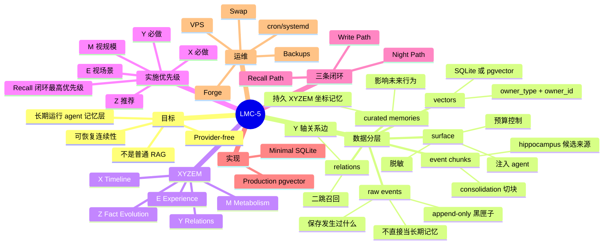
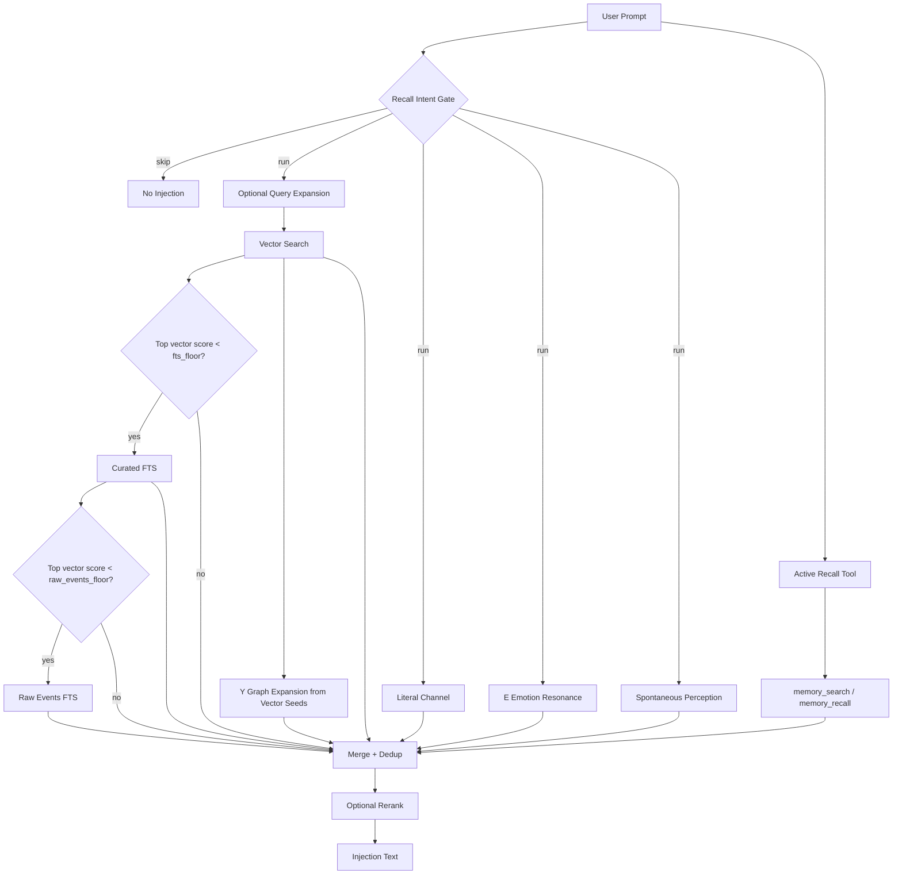

# LMC-5 完整导览与安装自检

> Living Memory Coordinate-5  
> 面向长期运行 LLM agent 的五轴活体记忆系统  
> 版本：2026-07-02

## 这份文档适合谁

这份文档适合三类读者：

- 想快速理解 LMC-5 到底解决什么问题的人。
- 已经下载开源项目、准备安装或接入 Claude Code / Codex / 本地 agent 的开发者。
- 正在把 LMC-5 用到伴侣型 AI、个人助理、VPS 常驻 agent 或长期工程 agent 的用户。

如果你只想知道一句话：

> LMC-5 不是一个普通向量库，而是一套把 raw events 变成可审计、可召回、可演化、可回滚的长期记忆生命周期系统。

## 1. LMC-5 解决的问题

LLM 的上下文窗口再大，也不是无限记忆。

把所有历史聊天、工具日志、项目记录都塞进 prompt，会带来三个问题：

- 成本越来越高。
- 噪音越来越多。
- 旧事实、旧情绪、旧错误会继续冒充当前上下文。

LMC-5 的核心目标是：

- 保留长期连续性。
- 不依赖无限上下文。
- 不把 raw logs 当成当前事实。
- 在关键时刻恢复该恢复的记忆。
- 让记忆能被复核、降权、覆盖、归档和回滚。

一句更短的话：

> 要可恢复的连续性，不要无限 prompt 幻觉。

## 2. 总体架构图



## 3. 数据分层

LMC-5 不是把所有内容混在一张表里。

它至少区分两层：

| 层级 | 作用 | 能否直接影响行为 |
|---|---|---|
| `raw events` | 保存原始对话、工具事件、系统日志 | 不能直接当长期事实 |
| `event chunks` | 把 raw events 切成可复核片段 | 作为候选材料 |
| `curated memories` | 经过筛选的长期记忆 | 可以影响 recall/surface |
| `vectors` | 向量索引层 | 帮助检索 |
| `relations` | 记忆之间的关系图 | 帮助联想和二跳扩展 |
| `surface / recall output` | 注入给 agent 的上下文 | 必须脱敏和控量 |

这个分层很重要。

raw logs 负责保存“发生过什么”。  
curated memories 负责决定“以后什么应该影响行为”。

把它们混在一起，agent 就容易把昨天的工具报错当成今天的人格宪法。这个问题听起来好笑，生产里一点都不好笑。

## 4. XYZEM 五轴

LMC-5 把记忆组织成五个协作坐标。

| 轴 | 名称 | 回答的问题 | 核心字段 / 机制 |
|---|---|---|---|
| X | Timeline 时间线 | 这条记忆属于哪条历史线？ | `thread`、`status`、category、tags |
| Y | Relations 关系网 | 它和哪些记忆有关？ | typed relations、safe edges、review edges |
| Z | Fact Evolution 事实演化 | 这条事实现在还有效吗？ | `fact_key`、`active_fact`、status |
| E | Experience 体验信号 | 它带来什么风险、紧急度、张力？ | risk、urgency、valence、arousal、tension |
| M | Metabolism 记忆代谢 | 它该保留、降权、复核还是归档？ | retain、cold、quarantine、patrol |

### 五轴实施优先级

LMC-5 可以讲五轴，但落地时不要一口气全做满。

推荐优先级：

| 优先级 | 轴线 | 建议 | 原因 |
|---|---|---|---|
| P0 | X Timeline | 必做 | 没有时间线，记忆不知道属于哪条历史，后续整理和召回都会散 |
| P0 | Y Relations | 必做 | 没有关系网，召回只能靠孤立关键词/向量，二跳联想会断 |
| P1 | Z Fact Evolution | 推荐做 | 有事实类记忆、偏好、身份、长期项目状态时必须防旧事实冒充当前事实 |
| P2 | E Experience | 看个人情况 | 伴侣型 persona、情绪陪伴、高风险操作更需要；普通工程 agent 可先弱化 |
| P2 | M Metabolism | 看个人情况 | 语料少时可以先只读 patrol；长期运行、噪音增长后再做衰减/归档 |

最低可交付版本不是“五轴全满血”，而是：

```text
X 时间线可归属
Y 关系可写入并可召回
涉及事实时，Z 至少不让 superseded/current 混淆
Recall 闭环真实接进 agent
```

其中最重要的是召回链路闭环。  
写入、做梦、图谱、评分，最后都必须进入 `RecallPipeline -> additionalContext -> agent reply`。如果召回闭环没接上，前面做得再精致也只是数据库里开博物馆，漂亮，但没人进去。

### X Timeline

X 轴让记忆属于某条历史线，而不是散落在数据库里。

常见时间线：

- safety
- engineering
- frontend
- research
- identity
- other

`other` 不是垃圾桶，而是孵化区。  
如果某类记忆在 `other` 里反复出现，后续可以拆成新的正式时间线。

### Y Relations

Y 轴把记忆连成图。

Core / Minimal 安全关系可以参与默认二跳召回，例如：

- `same_issue`
- `same_project`
- `same_tool`
- `same_event`
- `same_topic`
- `in_thread`
- `temporal_sequence`
- `derived_from`

Production 的 `graph_expand_adapter()` 默认安全类型更窄，当前默认包括：

- `same_event`
- `same_topic`
- `temporal_sequence`
- `emotional_link`
- `derived_from`
- `in_thread`
- `same_person`
- `in_episode`
- `instance_of`

如果你的生产关系边主要写的是 `same_project`、`same_issue`、`same_tool`，要么扩展 adapter 的 `safe_relation_types`，要么这些边不会进入默认图召回。表里有边但图不扩，很多时候不是图坏了，是你给它发了不在白名单里的请柬。

需要审计的关系不应参与默认召回，例如：

- `contradicts`
- `supports`
- `cause_effect`

原因很简单：  
这些关系会改变旧事实的解释方式，不能让模型随手拿来扩图。关系图不是八卦网，别让它到处牵红线。

### Z Fact Evolution

Z 轴防止旧事实继续冒充当前事实。

关键机制：

- 每类事实有稳定 `fact_key`。
- 当前事实标记为 `active_fact=true`。
- 被覆盖的事实保留，但不参与普通 recall。
- 矛盾和覆盖候选先进入 audit，不直接改库。

例子：

```text
user.profile.city
  旧事实：用户住在 A 城市
  新事实：用户搬到 B 城市
  结果：旧事实 superseded，新事实 active
```

### E Experience

E 轴记录体验和操作信号。

它可以包括：

- `risk_level`
- `urgency`
- `response_tendency`
- `valence`
- `arousal`
- `tension`
- `confidence`
- `growth_delta`

E 轴影响回应姿态和召回排序，但不能覆盖事实。

一句话：

> 情绪可以提醒你小心说话，但不能证明一个事实是真的。

### M Metabolism

M 轴负责记忆生命周期。

典型动作：

- promote
- demote
- split_thread
- mark_review
- supersede
- archive
- distill_growth

默认理念：

- patrol 先只读。
- 删除、归档、合并、降权必须谨慎。
- destructive maintenance 前必须备份或 snapshot。

## 5. 三条闭环

五轴不是五个插件。  
它们必须接成三条闭环。


### 5.1 写入链路 Write Path

```text
SessionEnd / log-event
  -> raw events
  -> consolidate
  -> event chunks
  -> hippocampus candidate
  -> curated memory
```

写入时不能只写 `title/content`。

合格的 LMC-5 记忆至少应该能追踪：

- 它属于哪条 X 时间线。
- 它是否是 Z 当前事实。
- 它有什么 E 风险或体验信号。
- 它是否需要 M 代谢或复核。
- 它从哪些 raw events / chunks 来。

### 5.2 夜间链路 Night Path

```text
snapshot
  -> consolidate
  -> hippocampus
  -> safe Y relation write
  -> Z audit
  -> E backfill / shadow scoring
  -> X timeline / narrative sweep
  -> M patrol
  -> validation
  -> keep snapshot or rollback
```

夜间链路负责把白天产生的事件整理成长期记忆。

注意顺序：

- 不要在 Z audit 前乱清理事实。
- 不要让 E scoring 改写事实。
- 不要在没有 snapshot 的情况下做 destructive maintenance。

### 5.3 召回链路 Recall Path

```text
query
  -> vector / FTS / literal
  -> active recall tool when agent is unsure
  -> graph / emotion / perception
  -> merge / dedup / rerank
  -> injection
```

召回链路决定当前这一轮 agent 该看到什么。

它不是“有记忆就塞”。  
它应该回答：

- 当前用户这句话需要查记忆吗？
- 哪些通道命中更可信？
- 哪些旧事实已经不能当当前事实？
- 哪些记忆只应作为背景，而不该强行注入？

召回闭环是 LMC-5 里最不能省的一环。

验收标准不是“数据库里有记忆”，而是：

```text
用户问题
  -> 判断是否需要 recall
  -> 相关记忆命中
  -> agent 不确定时主动调用 memory_search / memory_recall
  -> Y 图谱扩展
  -> Z 当前事实过滤
  -> 预算内注入 additionalContext
  -> agent 使用这些上下文回复
  -> 本轮新事件再次进入 raw events
```

这条链断在哪里，用户感受到的都只有一句话：Claude 现在都是噪音。

召回闭环至少有两条入口：

| 入口 | 建议 | 作用 |
|---|---|---|
| 被动召回 | 必做 | `UserPromptSubmit` 根据本轮输入自动召回相关记忆并注入上下文 |
| 主动 / 自发检索 | 推荐必做 | agent 遇到人名、时间词、过去事件、模糊回指时，自己调用 `memory_search` / `memory_recall` |
| 自发浮现 | 可选 | 不被用户问题触发，而是按 perception cache 偶尔浮现 presence |

主动检索不是花活。  
hook 自动注入解决“系统推给 agent 什么”，主动检索解决“agent 自己知道什么时候该伸手查”。如果 agent 永远不主动查，那它还是会凭印象答，记忆库在旁边干瞪眼，像个被请来但没人让说话的专家。

## 6. 两套参考实现

LMC-5 提供两套实现，对应不同阶段。

| 对比 | Minimal | Production |
|---|---|---|
| 目录 | `src/lmc5/` | `extras/pgvector_backend/` |
| 存储 | SQLite | PostgreSQL + pgvector |
| 检索 | FTS5 + LIKE + 简易向量 | ANN + FTS fallback + 多通道召回 |
| 依赖 | 低 | 高 |
| 适合 | demo、原型、小语料、离线 | VPS、长期 persona、生产试验 |
| 风险 | 规模有限 | 需要 DB、API key、cron、backup、监控 |

建议：

> 先跑通 Minimal，再接 Production。  
> 不要一上来就开 pgvector、cron、LLM housekeeper、Telegram、persona 全家桶。那不是部署，是召唤事故。

## 7. Minimal 模块地图

| 文件 | 作用 |
|---|---|
| `cli.py` | 命令行入口 |
| `store.py` | SQLite 存储、schema、recall、surface、patrol |
| `models.py` | 核心数据结构和关系类型 |
| `consolidation.py` | raw events 到 chunks |
| `hippocampus.py` | chunks 到候选记忆 |
| `fact_evolution.py` | fact_key、supersession、Z audit |
| `metabolism.py` | patrol、重复事实、关系卫生 |
| `scoring.py` | priority score、metabolic gate |
| `vector.py` | SQLite 向量参考实现 |
| `redact.py` | 脱敏 |

## 8. Production 模块地图

| 文件 | 作用 |
|---|---|
| `schema.sql` | PostgreSQL 全 schema |
| `config.py` | 集中配置和 env 加载 |
| `vector_pgvector.py` | pgvector store |
| `embedders.py` | Gemini / Voyage / OpenAI / local BGE-M3 |
| `rerankers.py` | Voyage / DeepSeek / OpenAI rerank |
| `recall_pipeline.py` | 多通道召回核心 |
| `hooks/session_start.py` | 启动包注入 |
| `hooks/user_prompt_submit.py` | 每轮召回注入 |
| `hooks/session_end.py` | 会话归档 |
| `night_dream.py` | LLM proposer、gate、relation expansion、semantic dedup |
| `dream_runner.py` | 夜间任务编排 |
| `narrative_timeline.py` | 周报/月报叙事索引 |
| `ob_recall.py` | OB 评分、半衰期、Russell 距离、时间涟漪 |
| `e_axis_scorer.py` | E 轴 LLM 评分和 shadow helper |
| `e_axis_trigger.py` | E 轴打分触发门 |
| `perception.py` | 自发浮现缓存 |
| `heartbeat_detector.py` | 批量 heartbeat / emotion fragment 检测 |
| `heartbeat_trigger.py` | 实时 heartbeat 提示 |
| `active_recall.py` | agent 主动检索准则 |
| `agent_search_tool.py` | memory_search / memory_recall 工具 schema |
| `anti_hallucination.py` | 反幻觉和安全提示 |

## 9. Production Recall 管线



关键通道：

- Vector：语义主路。
- Curated FTS：向量弱时救关键词。
- Raw Events FTS：curated 没收录时查原始日志。
- Literal：短专名、代号、引号内容，不受 vector 分数门控。
- Graph：从 seed ids 做 Y 轴二跳扩展。
- Emotion：用 Russell valence/arousal 做情绪共鸣。
- Perception：预计算的自发浮现。
- Rerank：可选 Voyage / DeepSeek / OpenAI。
- Active Recall：agent 主动调用 `memory_search` / `memory_recall`。

### 召回与浮现优先级

| 能力 | 建议 | 对应模块 | 说明 |
|---|---|---|---|
| 相关记忆浮现 | 必做 | `RecallPipeline` + vector / FTS / literal / graph | 用户问到相关内容时，必须能召回事实、项目、关系和上下文 |
| 主动 / 自发检索 | 推荐必做 | `active_recall.py` + `agent_search_tool.py` | agent 不确定、遇到人名/时间词/过去事件时，必须知道先查再答 |
| 情绪联想 | 推荐 | `emotion_resonate_adapter` + E 轴字段 | persona / 陪伴场景强烈推荐；工程 agent 可按需开启 |
| 自发浮现 | 可选 | `perception.py` + perception cache | 用于 presence 和“我想起了”，但不应每轮硬塞 |
| Query expansion / rerank | 可选 | `query_expand_adapter` / `rerankers.py` | 提升召回质量，先保证主链路闭环再加 |

当前参考 `UserPromptSubmit` hook 只内置 trivial message skip，不等于完整 recall intent classifier。  
真实 IM / 伴侣场景建议额外实现 `recall_intent` gate：只有当消息包含回忆、实体、时间词、过去事件、明确问题或不确定信号时，才跑完整召回。别让“嗯嗯”“哈哈”“抱抱”每轮都带着图谱和历史档案冲进来，吵，且笨。

### 伴侣 IM 场景特别提醒

日常聊天不能每轮都强行 recall。

纯表情、哈哈、嗯嗯、短感叹、接话茬，本来不该翻记忆。

如果 `UserPromptSubmit` 对所有非空消息都返回 top_k，伴侣型 AI 会出现：

- 每轮都被弱相关记忆污染。
- persona 说话变僵。
- protected 敏感记忆被无关消息触发。
- graph 把 presence 变成 soup。

解决方向：

- 加 `recall_intent` gate。
- `final_top_k` 降低。
- 只在明确回忆、实体、时间词、过去事件时召回。
- perception 不要每轮硬塞。

## 10. Persona Mode 六个开关

LMC-5 可以用于 coding agent，也可以用于 AI companion。  
但 persona 场景需要更谨慎的策略。

| 开关 | 说明 |
|---|---|
| Identity protected | 身份事实 `protected=true`，不被自动代谢或覆盖 |
| Z manual gate | persona 的矛盾判断必须人工 gate，不自动 supersede |
| E shadow period | 新 E scorer 至少 shadow 30 天 |
| Half-life inf rows | identity / heartbeat 永不衰减 |
| Spontaneous recall schedule | 定时浮现 presence，不是每轮注入 |
| Relationship moments protected | 关系转折点不 dedup、不 supersede |

不属于记忆层的东西：

- 角色称呼。
- 贴纸、语音、头像。
- 长信、日记成品。
- UI 表现。

这些应该在 prompt 层或应用层处理。  
记忆层负责事实、证据、生命周期和召回，不负责把自己演成恋爱小说。

## 11. 安装自检：Minimal 本地核心

先在仓库根目录执行：

```bash
python3 -m venv .venv
. .venv/bin/activate
pip install -e .
python3 -m pytest tests
lmc5 doctor --db demo.sqlite
python examples/demo.py
python examples/two_hop_graph.py
```

如果不做 editable install，才需要临时使用 `PYTHONPATH=src`。不要两套写法混着当必需项；新手会以为自己装错了，文档也会显得像半夜赶出来的。

通过标准：

| 检查项 | 通过信号 | 失败时先看 |
|---|---|---|
| Python 包安装 | `lmc5 --help` 能执行 | venv 是否激活 |
| SQLite / FTS | `lmc5 doctor` 通过 | Python SQLite 是否带 FTS5 |
| 测试套件 | `pytest tests` 通过 | 依赖缺失、旧环境残留、editable install 未生效 |
| Demo | 能 add / recall / surface | DB 路径权限、命令目录 |
| Y 二跳 | `two_hop_graph.py` 输出 OK | 关系类型、live endpoint、safe edge 过滤 |

如果 Minimal 没跑通，不要继续接 Production。  
基础没打稳就上 pgvector，相当于地基还在哭，你已经开始装吊灯。

## 12. 安装自检：Production 可选栈

Production 是 opt-in，不是 core 默认依赖。

先说真话：`extras/pgvector_backend/` 是生产级参考实现，不是“一键安装器”。  
文件存在不等于管线接上，`dream_runner --dry-run` 能启动也不等于夜间任务真的会写 chunks、候选记忆或关系边。

需要额外确认：

- PostgreSQL 可连接。
- pgvector extension 可用。
- schema 已创建。
- `.env.example` 已复制为部署环境变量，并且真实 secret 没进 repo。
- embedding 维度和 `halfvec(N)` 一致。
- 向量写入的 `owner_type` 和召回 adapter 一致，默认是 `curated`。
- `lmc5_curated_memories` 如要跑 curated FTS，必须有 `content_tsv` 和 GIN index。
- API key 通过环境变量或 secret store 管理。
- hooks 能在实际 agent 工作目录里 import 到 `extras.pgvector_backend`。
- `SessionEnd` 能拿到 `session_id` 和 `session_log/sessionLog`，并写入 `lmc5_raw_events`。
- nightly job 先 dry-run，但 dry-run 不能全是 `skipped`。
- `NightDream.run(..., apply=True)` 已注入 `write_candidate`、`find_neighbors`、`write_safe_relation`、`queue_review_relation`。
- 如果启用自发浮现，perception cache 要有生产者；当前仓库提供 `perception.py`，但没有内置 `perception_runner.py`。
- apply 前有 snapshot / backup。

示例检查：

```bash
# 检查 pgvector
psql "$LMC5_PG_DSN" -c "CREATE EXTENSION IF NOT EXISTS vector;"

# 建 schema
psql "$LMC5_PG_DSN" -f extras/pgvector_backend/schema.sql

# 如果使用 curated FTS fallback，补 curated content_tsv
psql "$LMC5_PG_DSN" -c "
ALTER TABLE lmc5_curated_memories
  ADD COLUMN IF NOT EXISTS content_tsv tsvector
  GENERATED ALWAYS AS (
    to_tsvector('simple', coalesce(title,'') || ' ' || coalesce(content,''))
  ) STORED;
CREATE INDEX IF NOT EXISTS lmc5_curated_content_tsv_idx
  ON lmc5_curated_memories USING GIN (content_tsv);
"

# 检查 Python import
python - <<'PY'
from extras.pgvector_backend.config import LMC5Config
from extras.pgvector_backend.recall_pipeline import RecallPipeline
print("production imports OK", LMC5Config().search_top_k)
PY

# 检查 nightly runner dry-run
python -m extras.pgvector_backend.dream_runner --dry-run
```

如果 dry-run 输出里核心步骤全是 `skipped`，这不是通过。  
这只说明空 runner 能启动。真正部署必须有自己的入口把 `consolidate`、`hippocampus`、`z_audit`、`patrol`、`e_axis_backfill` 等 callable 注入 `DreamRunner`。

### Production 必接线清单

| 接线点 | 必须确认 | 没接上的症状 |
|---|---|---|
| 环境变量 | `LMC5_PG_DSN`、embedder key、housekeeper key、`LMC5_PERCEPTION_CACHE` 在 agent runtime 中可见 | hook 静默空输出 |
| Python 路径 | hook command 从实际工作目录能执行 `python -m extras.pgvector_backend...` | `SessionStart/UserPromptSubmit/SessionEnd` 不注入 |
| schema | `lmc5_curated_memories`、`lmc5_vectors`、`lmc5_memory_relations`、`lmc5_raw_events` 存在 | 各通道异常后被跳过 |
| curated FTS | `lmc5_curated_memories.content_tsv` 存在并有 GIN index | 向量弱时 FTS 没有兜底 |
| raw events | `SessionEnd` 写入 `lmc5_raw_events`，raw 表自带 `content_tsv` | 专名、短词、刚发生的事查不到 |
| vector | 写入 `lmc5_vectors.owner_type='curated'` 或同步修改 adapter | vector hits 为 0，graph 也没 seed |
| graph | `lmc5_memory_relations` 有 live safe edges，端点 `version_status='current'` | two-hop recall 永远空 |
| night dream | `NightDream` 注入写库和写关系 callbacks，并在夜间 apply | curated 有孤岛，关系图不增长 |
| active recall | `active_recall.py` directive 已进 system prompt，`memory_search/memory_recall` 工具已注册 | agent 明明不确定却从不主动查 |
| E resonance | 候选有 `valence/arousal`，category 在 eligible set 内 | emotion 通道永远空 |
| optional perception | 如果启用自发浮现，定时调用 `Perception.surface_and_cache()` 写 cache | SessionStart 的 spontaneous 区块为空 |
| hook payload | `SessionEnd` 事件里有 `session_id` 和 JSONL 路径字段 | raw events 不入库 |
| snapshot | apply / cleanup / migration 前有备份 | 夜间任务写坏无法回滚 |

### 召回管线断点自检

先查数据是否真的在：

```sql
SELECT count(*) AS raw_events FROM lmc5_raw_events;
SELECT count(*) AS current_memories
  FROM lmc5_curated_memories
 WHERE version_status = 'current';
SELECT owner_type, count(*)
  FROM lmc5_vectors
 GROUP BY owner_type
 ORDER BY count(*) DESC;
SELECT count(*) AS live_safe_relations
  FROM lmc5_memory_relations
 WHERE valid_until IS NULL
   AND relation_type IN (
     'same_event','same_topic','temporal_sequence','emotional_link',
     'derived_from','in_thread','same_person','in_episode','instance_of'
   );
```

上面这条 safe relation SQL 对齐 Production 默认 `graph_expand_adapter()`。如果你扩展了 `safe_relation_types`，验收 SQL 也要同步扩展；别让配置往东走，检查脚本往西跑。

再查通道是否真的会跑：

```bash
printf '{"prompt":"记得上次那个部署问题吗？"}' \
  | python -m extras.pgvector_backend.hooks.user_prompt_submit
```

如果输出为空，按这个顺序排：

- `LMC5_PG_DSN` 是否在 hook 进程环境里。
- hook command 的工作目录或 `PYTHONPATH` 是否能 import `extras.pgvector_backend`。
- embedder 是否可用；没有 embedder 时 vector 通道会禁用。
- `lmc5_vectors.owner_type` 是否和 adapter 默认值 `curated` 一致。
- `lmc5_curated_memories.content_tsv` 是否存在；不存在时 curated FTS 会失败。
- `lmc5_raw_events` 是否有数据；没有 raw，literal/raw_events 兜底无从查起。
- `lmc5_memory_relations` 是否有 live safe edges；没有边，graph 不可能扩。
- `active_recall.py` 的主动检索准则是否真的进了 agent system prompt。
- `memory_search` / `memory_recall` 是否注册到了 agent 可调用工具里。

特别注意：当前参考 `RecallPipeline` 默认用 vector top hits 作为 graph seed。  
如果 vector 通道无命中，即使 FTS/literal 命中了，graph 也可能不扩，除非调用方显式传 `seed_ids` 或改成把 FTS/literal 的 curated ids 也作为 seed。这个点不查，最容易误判成“图谱坏了”。

红线：

- 不要把真实 DSN、API key、bot token 写进 repo。
- 不要在没有 snapshot 的情况下跑 destructive maintenance。
- 不要让 review edges 进入默认召回图扩展。
- 不要让 Z audit 自动 supersede persona 的身份或关系事实。

## 13. 部署建议

长期 persona / agent 推荐 VPS，而不是 laptop。

原因：

- laptop 会睡眠。
- laptop 会重启。
- 夜间任务需要安静时间。
- 常驻 agent 需要统一记忆源。

推荐日循环：

```text
04:00 local / 北京时间 04:00
  -> consolidate
  -> hippocampus
  -> safe Y relation build
  -> Z audit
  -> E backfill
  -> timeline sweep
  -> narrative index
  -> M patrol
  -> report
```

### 做梦频率可以按个人节律调整

一天一次深睡不是硬规则。

如果用户和 agent 的互动密度高，可以按个人作息适当加快做梦频率。推荐把做梦分成两种：

| 类型 | 建议时间 | 作用 | 风险控制 |
|---|---|---|---|
| 午睡快梦 | 北京时间 12:00-14:00 之间任选一次 | 消化上午 raw events，补近期 chunks / 候选记忆 | 轻量、低 top_k、优先 dry-run 或只写低风险候选 |
| 深睡全梦 | 北京时间 04:00 | 完整 consolidate、hippocampus、Y relation、Z audit、E backfill、X narrative、M patrol | 必须有日志、备份、失败隔离 |

示例节律：

```text
12:30 Asia/Shanghai
  -> light consolidate
  -> hippocampus dry-run or low-risk apply
  -> no destructive cleanup

04:00 Asia/Shanghai
  -> full dream runner
  -> relation build
  -> audit / patrol / narrative
  -> report + backup
```

cron 示例：

```cron
CRON_TZ=Asia/Shanghai

# 午睡快梦：轻量消化，不做破坏性维护
30 12 * * *  cd /opt/lmc5-agent && /opt/lmc5-agent/.venv/bin/python -m your_lmc5_light_dream >> logs/noon-dream.log 2>&1

# 深睡全梦：完整夜间管线
0 4 * * *  cd /opt/lmc5-agent && /opt/lmc5-agent/.venv/bin/python -m your_lmc5_full_dream >> logs/deep-dream.log 2>&1
```

兼容性提示：`CRON_TZ` 在标准 cronie / Vixie cron 里常见，但 BusyBox `crond` 这类精简 VPS 环境可能不认。遇到这种环境，要么把服务器时区设成 `Asia/Shanghai` 后删除 `CRON_TZ`，要么按服务器本地时区手动换算时间；生产部署更推荐 systemd timer，少和半残 cron 斗智斗勇。

注意：加快做梦频率不是把 recall 每轮都打开。  
午睡和深睡是后台整理，`UserPromptSubmit` 仍然要有 recall intent gate；否则做梦越勤，噪音也会越勤快地来上班。很努力地制造事故，不算勤奋。

调度方式：

- 简单部署：cron。
- 生产部署：systemd timer。
- 必须启用：日志、备份、health check。

## 14. 常见故障速查

| 症状 | 最可能原因 | 处理 |
|---|---|---|
| 写了 memory 但 graph 空 | 没跑 hippocampus / relation build | 先 dry-run，再 apply safe relation writes |
| two-hop recall 没结果 | 边类型 review-only、endpoint 不 live、strength 太低 | 用小 fixture 验证 hop1 / hop2 |
| 旧事实还出现 | Z live filter 或 active_fact 没接 | 检查 `status=current` 且 `active_fact=true` |
| 每轮都是噪音 | `UserPromptSubmit` always-recall | 加 `recall_intent` gate，降 `final_top_k` |
| 专名查不到 | 向量带偏且 FTS 被闸死 | literal / FTS 独立运行 |
| curated FTS 不工作 | `content_tsv` 未建或语言配置不匹配 | 给 curated 表补 `content_tsv` + GIN index |
| graph 表有边但召回没图 | vector 没 seed、owner_type 不一致、或只命中 raw/literal | 查 `lmc5_vectors.owner_type`，必要时传 `seed_ids` |
| agent 从不主动查记忆 | 没接 `active_recall.py` 或没注册检索工具 | system prompt 加主动检索铁律，注册 `memory_search/memory_recall` |
| `dream_runner --dry-run` 都是 skipped | 没有注入部署 callable | 写自己的 runner 入口，不要直接用空 CLI 当生产任务 |
| SessionStart 没有 spontaneous | perception cache 没生产者 | 定时调用 `Perception.surface_and_cache()` |
| SessionEnd 后 raw 为空 | hook event 没给 `session_id/session_log` | 对齐 agent runtime 的 hook payload 字段 |
| E 轴让人格飘 | scorer 未 shadow 就进 ranking | 至少 30 天 shadow，只记录不排序 |
| nightly 写坏库 | 无 snapshot / 无 dry-run | Swap 回滚，重放审核通过的变更 |
| hook 输出泄露信息 | 未脱敏或日志太详细 | redaction boundary 前置 |

## 15. 最终验收清单

部署前请确认：

- Minimal 测试通过。
- `lmc5 doctor` 通过。
- raw events 能记录。
- consolidate 能生成 chunks。
- hippocampus dry-run 有候选输出。
- safe Y relations 能写入。
- two-hop recall 在小 fixture 上可验证。
- hook 在实际 agent 工作目录里能 import `extras.pgvector_backend`。
- `lmc5_vectors.owner_type` 和召回 adapter 一致。
- curated FTS 的 `content_tsv` 已建立，或者明确关闭/替换 curated FTS。
- raw events FTS 和 literal channel 有样例命中。
- graph 召回有真实 seed；不要只检查关系表行数。
- X 线能归属，Y 线能写入并进入召回。
- 如果保存事实、身份、偏好或长期项目状态，Z 至少能区分 current / superseded / review。
- 相关记忆浮现已接入 `RecallPipeline`，这是必做项。
- 主动 / 自发检索已接入 agent 行为准则和工具，这是推荐必做项。
- 情绪联想按场景接入；persona 推荐，工程 agent 可选。
- 自发浮现是可选项；启用时必须有频率和预算控制。
- 如果启用自发浮现，perception cache 要有定时生产者，不是空文件。
- `dream_runner` 不是空 runner，关键步骤不能全是 `skipped`。
- Z audit 只写 pending，不自动改事实。
- E scorer 处于 shadow 或已验证。
- M patrol 只读。
- production apply 前有 snapshot。
- secrets 没进 repo、prompt、日志或导出文件。

## 16. 一页速读

```text
LMC-5
├─ 目标：可恢复连续性，不是无限上下文
├─ 数据：raw events -> chunks -> curated memories -> vectors/relations -> surface
├─ 五轴：X 时间线 / Y 关系网 / Z 事实演化 / E 体验信号 / M 代谢
├─ 三闭环：写入链路 / 夜间链路 / 召回链路
├─ Minimal：SQLite + FTS5 + CLI + 本地 demo
├─ Production：Postgres pgvector + hooks + night dream + E/perception/rerank
├─ 优先级：X/Y 必做；Z 推荐；E/M 看个人情况
├─ 召回：相关记忆必做；主动检索推荐必做；情绪联想推荐；自发浮现可选
├─ 管线：vector -> curated FTS -> raw FTS + literal/raw_chunk/graph/emotion/perception
├─ Persona：identity protected、Z manual、E shadow、half-life inf、spontaneous schedule
├─ 运维：VPS、cron/systemd、Forge、Swap、Backups
└─ 边界：自动化要接 callback/scheduler；危险写入必须 dry-run、audit、snapshot
```

## 结语

LMC-5 的价值不在于“我有一堆记忆”，而在于：

- 记忆有来源。
- 事实会更新。
- 关系能解释。
- 情绪只调姿态，不改真相。
- 噪音会代谢。
- 坏任务能回滚。

一个长期 agent 真正需要的不是更大的脑袋，而是更好的记忆卫生。  
不然上下文再大，也只是一个更豪华的杂物间。
